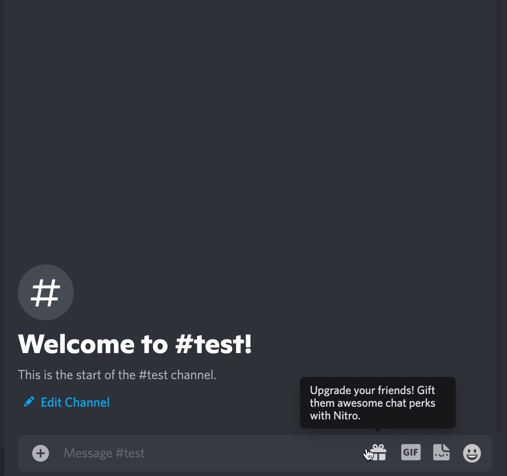

# Chikoroko-bot

A discord bot for watching opensea collections floor price..

## Prerequisites

- discord account, regist [here](https://discord.com)

- create a application bot, [here](https://discord.com/developers/applications) 

- get a bot token/guild_id/cliend_id/channel_id from previos step, and add that bot in your server

- optional: ensure your network can access all we used sites, or you need a vpn.
  
  I recommend you use [replit](https://replit.com/), and my bot is on it.

- optional: uptimerobot account, regist [here](https://uptimerobot.com/)

## Installation
 
 run command `npm i`

## Getting Started

1. Check `config.js`

    > In generally, you don't need to change anything, unless you know what it is.

2. Update your discord bot token in `.env`, you need create this file if it not exit.

3. Deploy commands, run cmmand `npm run deploy_command`

4. Run wathcer

  run cmd `npm run start`, will run a watcher

4. Using commands

  You can use commands to restart or cancel a watcher as below:

  | Command      | Description | parameters    |
  | :---         | :----  |          :---|
  | /watch_floor      |  Start watching floor price of collections      | - |
  | /unwatch_floor   | Stop watching floor price of collections        | -  |
  | /add_collection_floor   | Add new collection floor price for watching        | `name`: collection name   `price`: expect price  |
  | /remove_collection_floor   | Remove a collection from watching list| `collection_index`: The collection index which you want to remove, you can get it from command /list_collections_floor  |
  | /update_collection_floor   | Update a collection's floor price        | `collection_index`: The collection index which you want to update, you can get it from command /list_collections_floor   `new_price`: new expect price  |
  | /list_collections_floor   | List all watched collections       | -  |

5. optional: running 24/7

 if you want running bot 24/7, you need do all optional steps in this readme doc, more detail please refer [Host-a-Discord-Bot-online-247-for-FREE](https://www.showwcase.com/show/11710/Host-a-Discord-Bot-online-247-for-FREE!)